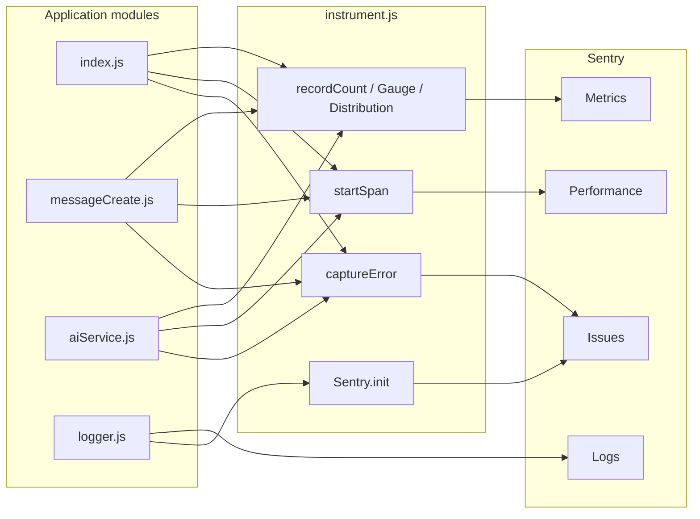

# Observability

The bot integrates [Sentry](https://sentry.io/) for errors, performance tracing, structured logs, custom metrics, and optional profiling. All telemetry flows through [`instrument.js`](../instrument.js), which **must load before** other application modules.

## Enabling Sentry

Set `SENTRY_DSN` in Doppler (or your environment). Without a DSN, Sentry initializes but does not send events.

## Environment variables

| Variable | Default | Description |
|----------|---------|-------------|
| `SENTRY_DSN` | *(unset)* | Sentry project DSN |
| `SENTRY_TRACES_SAMPLE_RATE` | `1.0` | Performance trace sample rate (`0.0`–`1.0`) |
| `SENTRY_PROFILE_SESSION_SAMPLE_RATE` | `1.0` | Profiling sample rate (`0.0`–`1.0`) |
| `SENTRY_PROFILE_LIFECYCLE` | `trace` | Profile lifecycle mode (e.g. `trace`, `manual`) |
| `SENTRY_ENABLE_LOGS` | `true` | Forward Pino logs to Sentry (`false` to disable) |
| `SENTRY_ENABLE_METRICS` | `true` | Emit custom metrics (`false` to disable) |
| `NODE_ENV` | `production` | Sentry environment tag |

Sample rates are clamped to `[0, 1]`. Invalid values fall back to `1.0`.

## Errors

Use `captureError(error, tags)` from `instrument.js`. Tags are stringified and attached to the Sentry scope before `captureException`.

Used in: `index.js`, `config.js`, `deploy-commands.js`, `aiService.js`, `messageCreate.js`, `ready.js`, `reset.js`.

## Performance (traces)

`startSpan(options, callback)` wraps async work in Sentry performance spans. If `Sentry.startSpan` is unavailable, the callback runs directly.

| Span context | Module | Purpose |
|--------------|--------|---------|
| Client ready | `index.js` | Bot login lifecycle |
| Slash / context menu handlers | `index.js` | Command execution |
| Message AI response | `messageCreate.js` | End-to-end message handling |
| AI provider call | `aiService.js` | OpenAI / Gemini / Claude request |
| Command deploy | `deploy-commands.js` | Slash command registration |
| Ready event | `ready.js` | Post-login setup |

Profiling uses `@sentry/profiling-node` when available; if the integration fails to load, the bot continues without profiling.

## Logs

[`logger.js`](../logger.js) wraps Pino and forwards `info`, `warn`, `error`, `debug`, `trace`, and `fatal` to `Sentry.logger` when logs are enabled. Forwarding failures are swallowed and logged at debug level locally.

Configure log verbosity with `LOG_LEVEL` (see `config.js`).

## Custom metrics

Metrics are no-ops when Sentry is disabled or metrics are turned off. Attributes are normalized (objects JSON-stringified; `null`/`undefined` dropped).

### Counters (`recordCount`)

| Metric | Attributes | Source |
|--------|------------|--------|
| `ai.generate.requests` | `provider`, `outcome` | `aiService.js` |
| `discord.message.received` | `provider`, `trigger` | `messageCreate.js` |
| `discord.message.responded` | `provider`, `outcome` | `messageCreate.js` |
| `discord.message.rejected` | `reason` | `messageCreate.js` |
| `discord.command.executed` | `command`, `outcome` | `index.js` |
| `discord.context_menu.executed` | `command`, `outcome` | `index.js` |
| `discord.api.failure` | `location`, `status` | multiple |
| `discord.api.rate_limit` | `location` | multiple |
| `discord.login` | — | `index.js` |
| `discord.ready` | `outcome` | `ready.js` |
| `discord.deploy_commands` | `outcome` | `deploy-commands.js` |
| `discord.reset.executed` | `scope`, `outcome` | `reset.js` |

### Gauges (`recordGauge`)

| Metric | Attributes | Source |
|--------|------------|--------|
| `discord.channel.queue_depth` | `provider` | `messageCreate.js` |

### Distributions (`recordDistribution`)

| Metric | Unit | Source |
|--------|------|--------|
| `ai.generate.duration_ms` | ms | `aiService.js` |
| `discord.message.processing_ms` | ms | `messageCreate.js` |
| `discord.message.response_chars` | — | `messageCreate.js` |
| `discord.command.duration_ms` | ms | `index.js` |
| `discord.context_menu.duration_ms` | ms | `index.js` |
| `discord.deploy_commands.duration_ms` | ms | `deploy-commands.js` |
| `discord.reset.duration_ms` | ms | `reset.js` |
| `discord.ready.duration_ms` | ms | `ready.js` |

## Graceful shutdown

`closeSentry()` calls `Sentry.close(2000)` during process shutdown (see `index.js` signal handlers) to flush pending events.

## Validating in Sentry

After deploying with `SENTRY_DSN` set:

1. **Issues** — trigger a handled error or use `/reset` with invalid permissions to see tagged exceptions.
2. **Performance** — mention the bot and inspect spans for `messageCreate` and `ai.generate`.
3. **Logs** — confirm structured log lines appear when `SENTRY_ENABLE_LOGS` is true.
4. **Metrics** — open the Metrics explorer and filter by names above (e.g. `discord.message.received`).

## Testing observability code

Sentry modules are covered at 100% in the test suite. See [`test/instrument.test.js`](../test/instrument.test.js) and [`test/logger.test.js`](../test/logger.test.js). Run `pnpm test:coverage:check` locally to verify.
